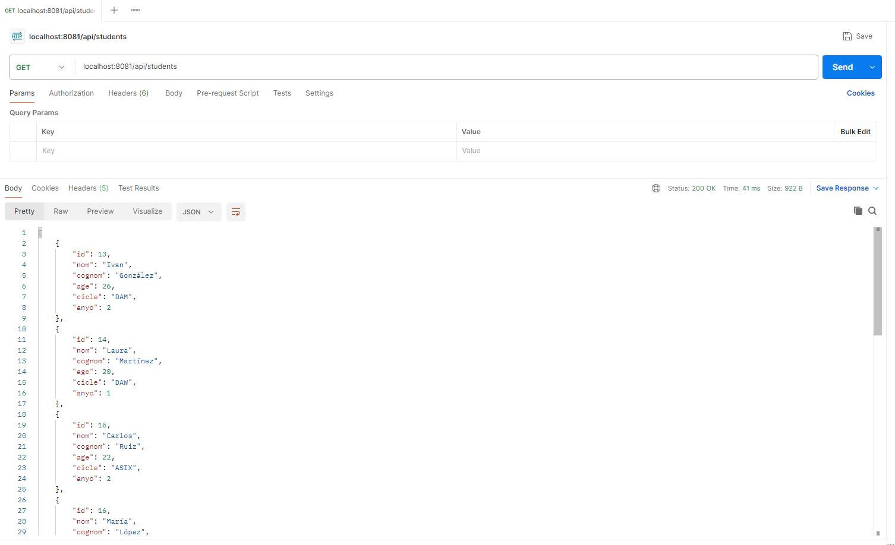
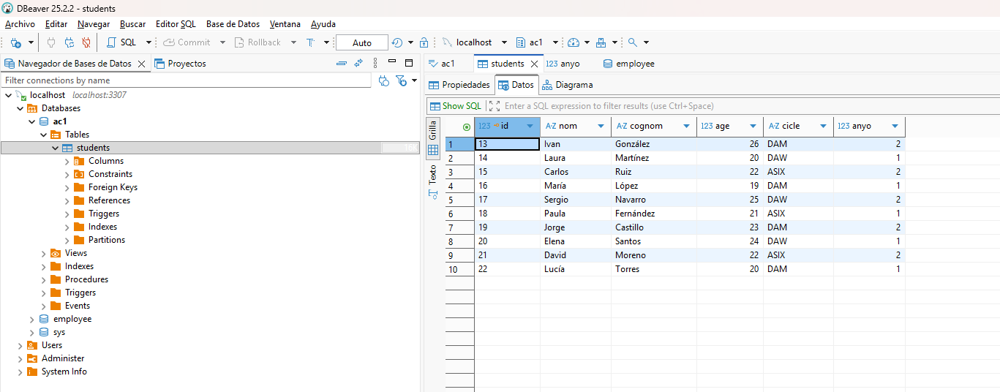

# Endpoints
## POST localhost:8081/api/students/batch
Crea 10 estudiants a la base de dades i retorna un missatge de feedback

## GET localhost:8081/api/students
Retorna tots els estudiants de la base de dades

Podem veure que son 10 a DBeaver
